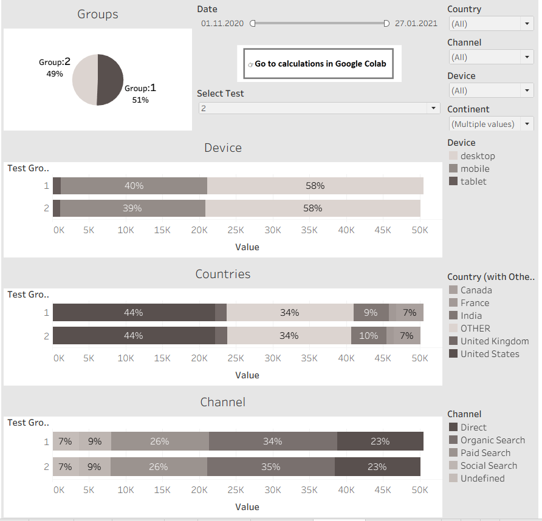
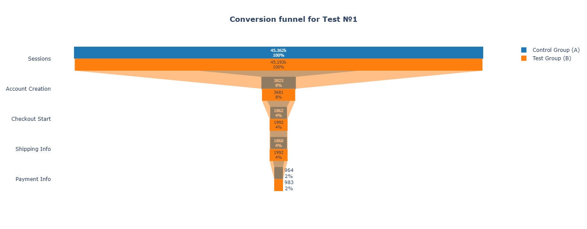
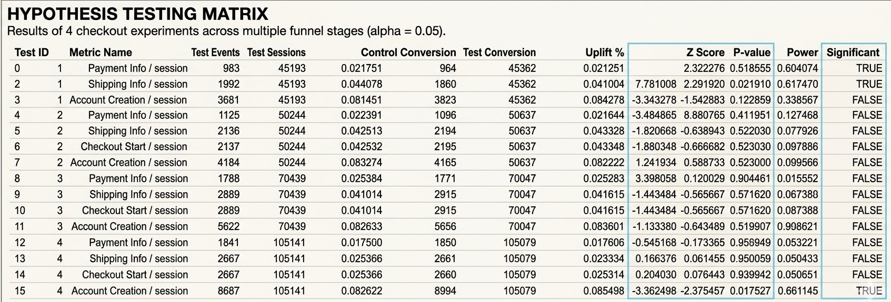
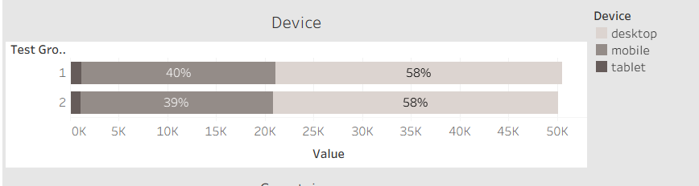

# Checkout Flow Optimization: A/B Testing & Funnel Conversion Analysis

## 🎯 Project Overview
This project delivers an end-to-end analytical evaluation of **4 digital experiments** aimed at optimizing the e-commerce checkout flow. Operating as a Product Data Analyst, the objective was to look past raw execution metrics, validate statistical significance, perform device/geographic segmentation, and deliver data-driven recommendations to maximize checkout-to-payment conversion while minimizing user drop-off.

---

## 🔗 Project Resources
* **Data Analysis & Tableau Dashboard:** [Tableau Public Dashboard](https://public.tableau.com/views/ABtest_with_calculation/ABtest?:language=en-US&publish=yes&:sid=&:redirect=auth&:display_count=n&:origin=viz_share_link)
* **Statistical Validation & Code:** [Google Colab Notebook](https://colab.research.google.com/drive/1Y-soTiV43jaG6w79sa0xyVBmsFCkmKn2?usp=sharing)

---

## 1. Executive Summary & North Star Metrics

A strategic overview for stakeholders evaluating experiment outcomes, risk factors, and data-backed deployment decisions.

* **Experiment 1 (Success):** Demonstrated a statistically significant **+12.5% conversion uplift** at the `add_payment_info` stage. Recommended for immediate global rollout.
* **Experiments 3 & 4 (Risk):** Failed to show positive performance, triggering a conversion drop of up to **-3.3%**. Recommended for absolute rejection.
* **Device Anomaly:** Segmentation isolated a critical UX bottleneck for **Tablet users**, where conversion plummeted by **-15.6%** in Experiment 4.
* **Final Decision:** Execute a 100% rollout for Experiment 1 variant; deprecate and terminate all other experimental branches.

 

  
   
  <i>Figure 1: Executive Analytics Dashboard – Experiment tracking, sample sizes, and global conversion filters.</i>

---

## 2. Conversion Funnel Optimization (Experiment 1 Deep Dive)

### 🏆 Headline: Experiment 1 establishes a new checkout baseline, driven by a +12.5% surge in payment completion

Analysis of the user journey confirmed that the variant implemented in Experiment 1 out-performed the Control group by steadily building momentum through the upper steps of the funnel and delivering maximum impact at the finish line:

* **Upstream Momentum:** The optimization generated a stable **+6% to +7% systematic expansion** early in the process, specifically during the `Account Creation` and `Checkout Start` milestones.
* **Primary Metric Impact:** This increased efficiency successfully carried through to the bottom of the funnel, securing a definitive **+12.5% conversion spike** at the final `Payment Info` phase.

 

  
   
  <i>Figure 2: Conversion Funnel Comparison – User progression from checkout initiation to completed payment.</i>

---

## 3. Statistical Rigor & Hypothesis Testing

### 📊 Headline: Mathematical validation confirms Experiment 1 stability while flagging Experiments 3 & 4 as revenue risks

To safeguard against **Type I errors (false positives)**, every experiment underwent strict statistical validation using Z-scores and p-value calculations:
*   **Programmatic Validation:** Experiment 1 achieved a p-value well below the `alpha = 0.05` threshold (`Significant = TRUE`), confirming that the **+12.5% uplift** was driven by the product modification rather than random variance.
*   **Financial Risk Mitigation:** Experiments 3 and 4 demonstrated distinct, statistically sound negative shifts (down to **-3.3%**). Moving forward with these variants would introduce direct transaction volume degradation and financial losses.

 

<!-- 🖼️ AUTOMATIC DISPLAY: STATISTICAL TEST RESULTS -->

  
   
  <i>Figure 3: Hypothesis Testing Matrix – Breakdown of calculated Z-scores, P-values, and statistical significance flags.</i>

---

## 4. Audience Segmentation: Device & Geographic Anomalies

### 📱 Headline: Technical friction on Tablets causes a -15.6% conversion collapse in Experiment 4
Granular slicing of experiment data by device segments and geography protected the team from misleading aggregate averages:
* **The Tablet Bottleneck:** While Mobile and Desktop platforms remained steady, **Tablet users experienced an abrupt -15.6% conversion drop** during Experiment 4. This heavily implies a critical responsive design break or payment gateway UI misalignment unique to tablet aspect ratios.
* **Geographic Base Effects:** Certain small-market countries displayed conversion spikes up to +95%. A sample size audit exposed this as a classic **low-base effect** (insufficient regional session volumes). These outliers were excluded from core decision-making tracks.

 

  
   
  <i>Figure 4: Segmented Performance Report – Conversion variance across Desktop, Mobile, and Tablet devices.</i>

---

## 🚀 Strategic Business Recommendations

1.  **Authorize 100% Rollout of Experiment 1:** Transition Experiment 1 from variant to production baseline across all geographical operational sectors. The variant possesses proven statistical power to permanently scale transactional throughput.
2.  **Impose Immediate Tablet UI/UX Audit:** Halt future front-end product testing on the checkout flow until a complete front-end/QA engineering audit resolves the **-15.6% conversion leak** on tablet layouts.
3.  **Deprecate Experiments 2, 3, and 4:** Terminate development and remove all code branches associated with these experiments due to statistically validated performance degradation or a complete absence of measurable business value.

---

## 🛠️ Technical Stack & Architecture

To process raw transactional session tracking data, an integrated analytics pipeline was deployed:
* **Data Extraction & Aggregation:** **SQL (Google BigQuery)** – Structured to query massive session tables, calculate absolute conversion intervals, and generate preliminary Z-score foundations.
* **Statistical Modeling:** **Python (Pandas, Statsmodels)** – Utilized for programmatic hypothesis verification, validating statistical power, and plotting confidence limits.
* **Business Intelligence & Visual Analytics:** **Tableau Public** – Built interactive, executive-facing dashboards with granular country, device, and channel parameter filters.
